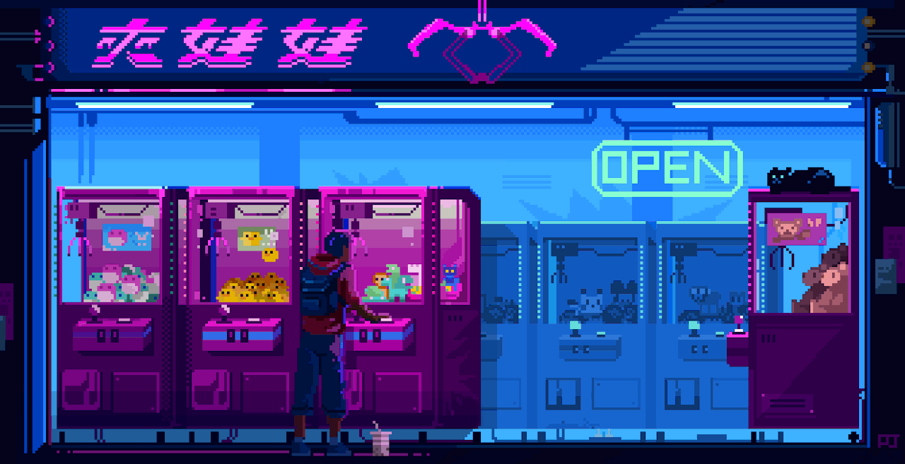

<h1>Hello World, eu sou Arthur Dias.</h1> 

 

<h3>✨Estudo Desenvolvimento web, na parte de Front End, Construindo aplicações com HTML, CSS e ReactJS.✨</h3>

  
  
  
  
  

 

  <h3>⚡Lingugens que conheço / estudo⚡<h3> 
  
  

    
    
    
    
  

    
 
    

  <h3>🌱Ferramentas que conheço / estudo🌱<h3> 
  
  

    
    
    
    
  

    
 
    

  <h3>😄Ente em contato😄</h3> 
  
  

    
    
   
  

    

 
  
   

  
  <h2 align="center">O que eu venho fazendo, e mais sobre mim </h2> 
  
  <h3>📚Atualmente eu estou estudando📚</h3>
  
  
 
    
    
  

  
   
  
  <h3>Sobre mim</h3>

    
Meu nome completo é Arthur Barbosa Dias, Ainda não tenho alguma experiência no mercado de trabalho, mas 
    pretendo trabalhar na área de desenvolvimento web como full stack, assim que terminar a escola. Gosto de desenvover 
    aplicações com um design moderno, e me dou bem em trabalhos em equipe.

   
    

  <h1 align="center" >Obrigado pela visita, Por favor me siga e volte sempre!</h1>
  
  

 
    
